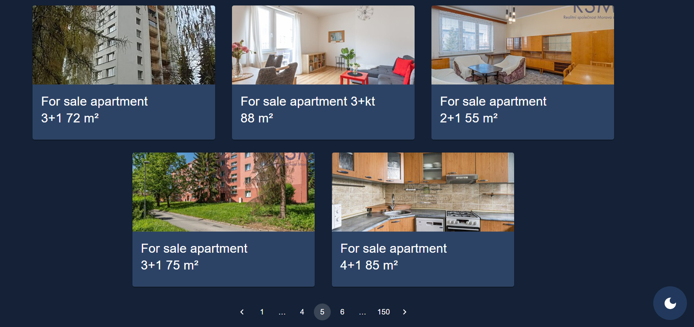

 # Full stack web scraper project

## Scraper
Written in typescript. Uses axios library to fetch 500 estates from czech real estate website: https://www.sreality.cz
(Its started after API is initialized)

## Database
A PostgreSQL database used for storing one entity: an Estate (url, name, locality). Interaction with db is via TypeORM, where the schema is defined.

## Api
An Express server written in Typescript. It folllows "Controller-Route-Model" arhitecture. Uses Swagger framework for API testing and documenting, available on http://localhost:8000/docs/

## Client

The frontend app, written in React and Typescript, built with Vite for faster development. UI is written with MUI(Material-UI) library with custom theme and light/dark mode. React-router-dom library is used for routing.
Pagination is used to traverse through all 500 estates on the same page.
If the site loads before the API express server is initialized, a button is visible that enables the user to manually call "fetch" data from the API that returns estates when its initialized.

## Docker

Database, API and client are three seperated and isolated images that are run and maintained in the  Docker environment

## Getting started

To get started with the project, follow the steps below:

1. Clone this repository:

   ```bash
   git clone https://github.com/JanHuntersi/flat-scraper.git
   ```

2. Navigate to the projects directory:

   ```bash
   cd flat-scraper
   ```

3. Build the docker image

   ```bash
   docker compose build
   ```
4. Start the application

   ```bash
   docker compose up
   ```

5. Wait for the API to initialize (terminal) and load the webapp

## Examples




